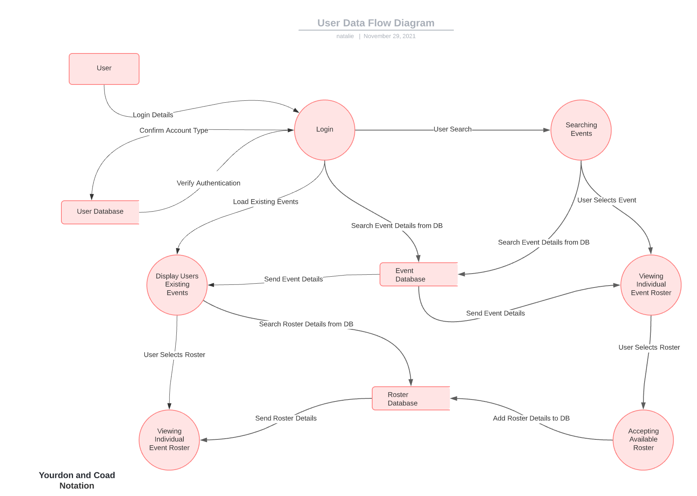
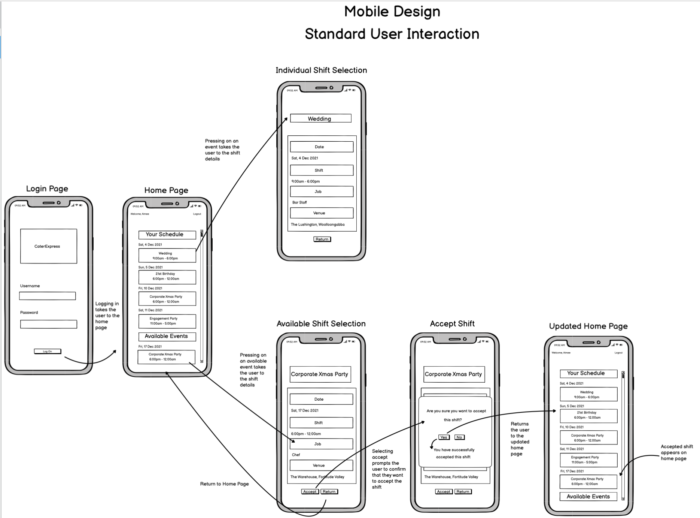
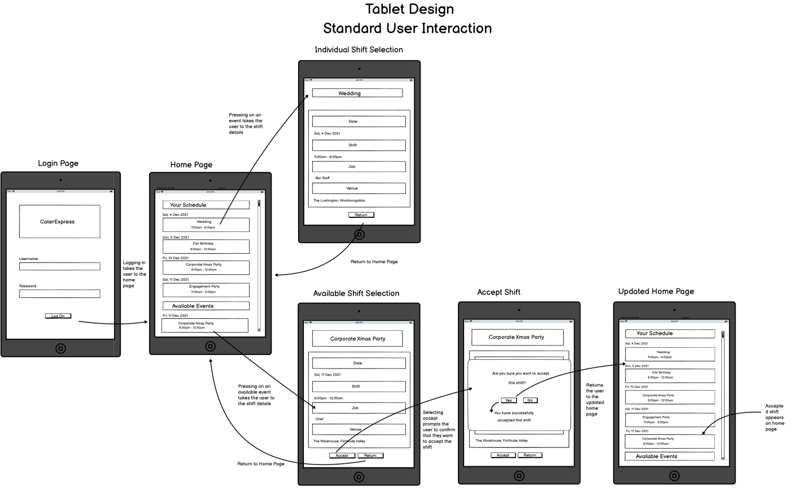
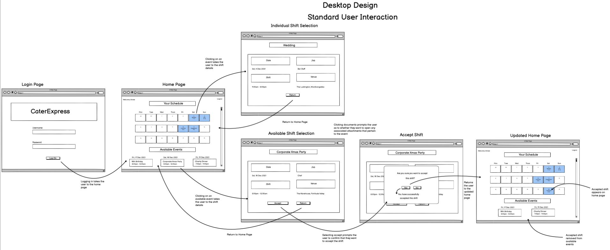
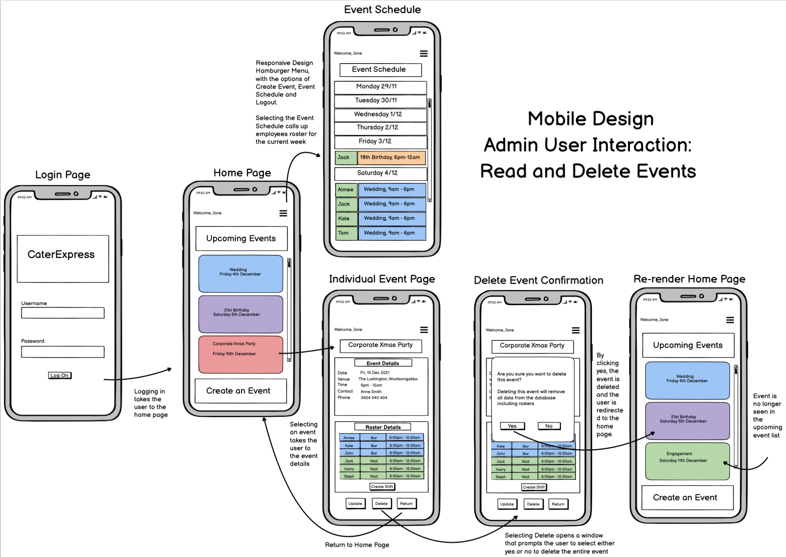

# App

## Purpose

Shared Affair is an event planning and catering company that services approximately 200 events a year. These events require meticulous planning and as the business scales the current planning and scheduling process is becoming outdated, slow, and unreliable.

The purpose of this app is to streamline the event planning process for Shared Affair by replacing the current procedure and tools in place; they currently use google calendar, excel spreadsheets and direct communication. The app will allow admins to easily create and roster events as well as provide a streamlined method for employees to track upcoming events, allow employees to self register for work, provide relevant event information including other rostered employees, food lists and custom notes, and provide a way to easily track upcoming work schedules.

Although there are existing systems and software like Deputy, foundU and Kronos that handle employee scheduling, these systems are built around immutable variables that make it difficult for event planning and catering businesses to use. As it stands, most rostering tools allow an admin user to create a roster based on a consistent location (this may be the entire business or an area of the business like the “Kitchen” at a cafe).

While a business can set different locations, the information associated to the location does not allow for changes or updates and lacks the functionality to create a significant number of “locations”. In addition, these systems do not allow a location to be created with associated document uploads, notes, or specific information and because of this lacking functionality they do not meet the needs of Shared Affair who are looking for a solution that allows them to plan and schedule out hundreds of events and rosters and share the information with it’s employees.

## Functionality and Features

Account Authentication

Secure account creation
Authentication through third party API
Simple log in/out (saving secure account data)
Admin and standard user permissions
Password and account recovery

Event record creation

Create a record for an event that logs and tracks time and location details, rostered employees, notes, attached documents.

Event record interaction (non-admin users)

Users can interact with all created events including relevant details, information and documentation/attachments
Users can schedule themselves to work an event
Users can view and download attached documents
Users can delete themselves from an event roster
Users can comment on event records
Event record interaction (Admin users)

Admin users can update event details and information
Admin users can delete an event
Admin users can update an event roster
Admin users can delete shifts and rosters

UI

Users (admin and standard) can interact with a navigation bar and page links
Users are notified when an action is completed on event records (pop up confirmations)
Users can view future scheduled events
Users can view their scheduled events

## Target Audience

## Tech Stack

## Dataflow Diagram

### Standard User DFD

### Admin User DFD - Create and Read Features

### Admin User DFD - Search and Update Features

## Application Architecture Diagram

## User Stories

# Wireframes 

## Standard User Mobile Wireframes

## Standard User Tablet Wireframes

## Standard User Desktop Wireframes

## Admin User Mobile Wireframes: Read & Delete Events

## Admin User Mobile Wireframes: Create & Update Events Rosters

## Admin User Mobile Wireframes: Delete Individual Shifts

## Admin User Tablet Wireframes: Read & Delete Events

## Admin User Tablet Wireframes: Create & Update Events Rosters

## Admin User Tablet Wireframes: Delete Individual Shifts

## Admin User Desktop Wireframes: Read & Delete Events

## Admin User Tablet Wireframes: Create & Update Events Rosters

## Admin User Tablet Wireframes: Delete Individual Shifts

## Trello board Screenshots

